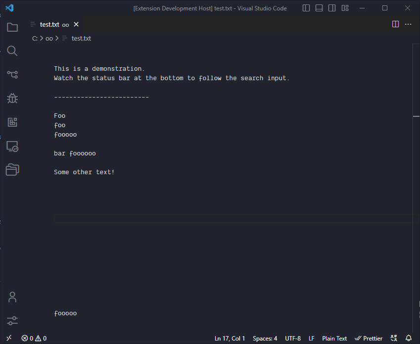

# Find & Jump 🔍🦘 (VS Code extension)

Easy way to find text, jump to it and cycle through matches, directly in your active editor window.


## Usage

1. Press a keybinding to activate search mode
2. Enter your search text
3. Every new character will show new matches and select the closest match automatically
4. Press another key (e.g. TAB) to cycle through the matches

The difference to other extensions like this is that every keystroke will show & select new matches, without the need to confirm your search first.



## Extension Settings

### Configuration

- `findAndJump.caseSensitiveSearch`
  - Use case-sensitive search
  - _default: false_
- `findAndJump.showTooltipIfNoMatches`
  - Show a tooltip if the current search has no matches
  - _default: false_
- `findAndJump.matchesColor.background`
  - Custom background color for all matches
  - _default: "#3e56c2"_
- `findAndJump.matchesColor.foreground`
  - Custom foreground color for all matches
  - _default: "white"_
- `findAndJump.currentMatchColor.background`
  - Custom background color for the currently selected match
  - _default: "#132eab"_
- `findAndJump.currentMatchColor.foreground`
  - Custom foreground color for the currently selected match
  - _default: "white"_

### Keybindings

There are three main keybindings: activate, exit and cycle through matches.

- `findAndJump.activateSearchMode`
  - Activate search mode
  - _default: Alt + Q_
- `findAndJump.exitSearchMode`
  - Exit search mode
  - _default: Escape_
- `findAndJump.cycleThroughMatches`
  - Cycle through results in search mode. Only active when search mode is active.
  - _default: Tab_
- `findAndJump.cycleThroughMatchesBackwards`
  - Cycle backwards through results in search mode. Only active when search mode is active.
  - _default: Shift + Tab_

Here's the default keybindings for the JSON settings:

```json
{
  "key": "alt+q",
  "command": "findAndJump.activateSearchMode",
  "when": "editorTextFocus"
},
{
  "key": "escape",
  "command": "findAndJump.exitSearchMode",
  "when": "editorTextFocus && findAndJump.isSearchModeActive"
},
{
  "key": "tab",
  "command": "findAndJump.cycleThroughMatches",
  "when": "editorTextFocus && findAndJump.isSearchModeActive"
},
{
  "key": "shift+tab",
  "command": "findAndJump.cycleThroughMatchesBackwards",
  "when": "editorTextFocus && findAndJump.isSearchModeActive"
},
```

## Release Notes

🚧 Still under construction 🚧

[Please refer to the GitHub releases.](https://github.com/bennettdams/find-and-jump/releases)
